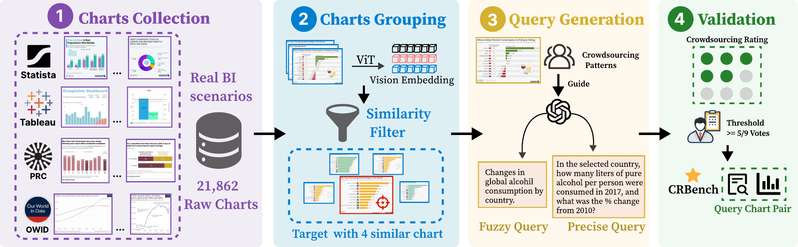
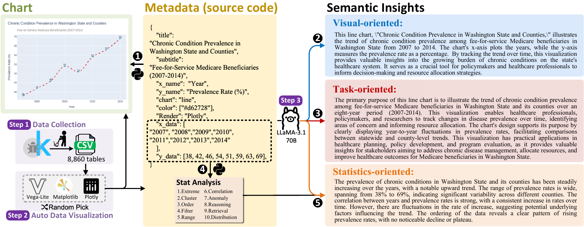
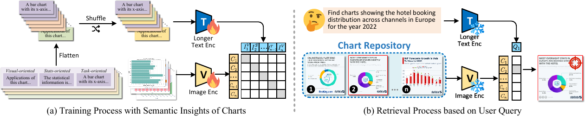
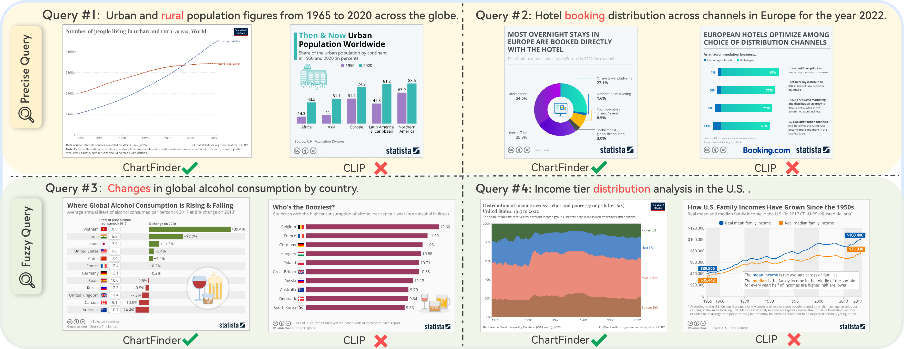

# CRBench

This is the official repository for the **EMNLP 2026** paper **“Boosting Text-to-Chart Retrieval through Synthesized Hierarchical Insights.”**

## Overview

CRBench is a benchmark for text-to-chart retrieval built from real-world business intelligence scenarios. It contains **326 text queries** and **21,862 charts**, with query-chart relevance labels verified through crowdsourcing.

We further introduce a semantic insight synthesis pipeline and **ChartFinder**, a strong text-to-chart retrieval model trained with hierarchical insights. The synthesized insights help the model bridge the gap between chart appearance and the analytical intent expressed in natural-language queries.

## CRBench Construction

CRBench is constructed through four stages: chart collection from real-world BI scenarios, similarity-based chart grouping, query generation, and crowdsourced validation. This process creates challenging candidate sets containing visually similar charts while ensuring reliable query-chart relevance labels.

## Hierarchical Semantic Insight Synthesis

Our automatic pipeline transforms chart metadata into three complementary levels of semantic insights:

- **Visual-oriented insights** describe the visual encodings and chart structure.
- **Statistics-oriented insights** summarize statistical patterns and relationships in the underlying data.
- **Task-oriented insights** capture the analytical goals and real-world questions supported by the chart.

## ChartFinder

ChartFinder learns visual-semantic representations from chart images and synthesized insights during training. At inference time, it directly matches a natural-language query against chart images and ranks the charts by embedding similarity.

## Case Study

The case study compares the Top-1 retrieval results of ChartFinder and CLIP, highlighting ChartFinder's stronger ability to identify charts that match the semantic intent of user queries.

## License

This project is released under the [MIT License](LICENSE).
